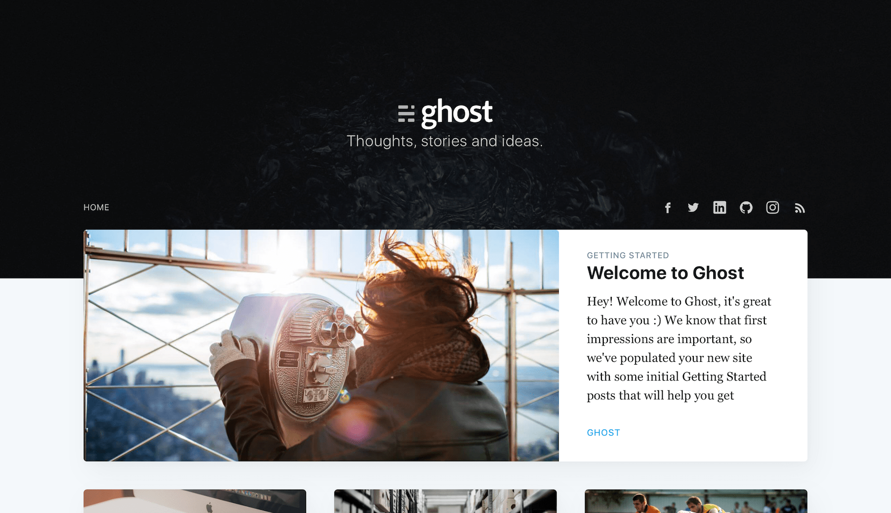
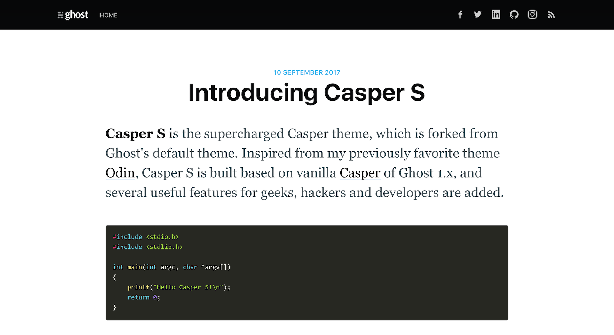

Casper S
========

The supercharged Casper theme for [Ghost](https://github.com/TryGhost/Ghost).

# Intro

**Casper S** is the supercharged Casper theme, which is forked from Ghost's default theme. Inspired from my previously favorite theme [Odin](https://github.com/h4t0n/odin), Casper S is built based on vanilla [Casper](https://github.com/TryGhost/Casper) of Ghost 1.x, and several useful features for geeks, hackers and developers are added.





## Features

* Vanilla Casper 2.1.1 style
* Works with Ghost 1.2+
* [Google Analytics](http://analytics.google.com) integration
* [Disqus](https://disqus.com) integration
* [Prism](http://prismjs.com)-powered syntax highlight
* Social links with [Simple Icons](https://simpleicons.org) integration

# Installation

Just like any themes for Ghost, clone or download the content of repo and put them in `content/themes/` folder under your Ghost installation.

```
$ cd /your-ghost-root-directory
$ git clone https://github.com/hungys/CasperS.git content/themes/CasperS
```

Then restart Ghost and select **casper-s** in the Design section of admin panel.

# Configuration

You can configure for Google Analytics, Disqus, and social links using Ghost's **Code Injection** feature. Just paste the following example to **Blog Header** section and fill in your information.

```
<script>
var ga_id = 'UA-xxxxxxxx-x';
var disqus_shortname = 'your-shortname'
var social_link = {
    'linkedin': 'https://www.linkedin.com/in/username',
    'github': 'https://github.com/username',
    'medium': 'https://medium.com/@userid',
    'casper-local': 'https://github.com/hungys/CasperS'
}
</script>
```

For social links, we provide icons for 20 popular services (check the following list). For this kind of services including `'linkedin'` and `'github'`, the icons will be loaded from your website directly. For other services such as `'medium'`, the icons will be loaded from [simpleicons.org](https://simpleicons.org), and you can check the full list on their website and [GitHub](https://github.com/simple-icons/simple-icons/tree/develop/icons). You can also use your custom SVG icons by attaching `-local` suffix to the key, for exmaple, `casper.svg` will be loaded for key `'casper-local'`, and you should prepare the icon and put it under `assets/icons/`.

```
'500px', 'facebook', 'flickr', 'github', 'gmail', 'googleplus', 'instagram', 'line', 'linkedin', 'messenger', 'microsoftoutlook', 'plurk', 'sinaweibo', 'skype', 'snapchat', 'stackoverflow', 'telegram', 'twitter', 'wechat', 'whatsapp'
```

# Copyright & License

Released under the [MIT License](LICENSE).

Copyright (c) 2013-2017 Ghost Foundation (for Casper theme)
